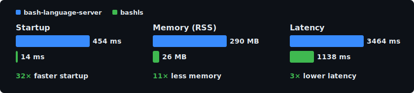

# bashls

[](https://github.com/k8s-1/bashls/actions/workflows/ci.yml)

A Rust alternative to [bash-language-server](https://github.com/bash-lsp/bash-language-server), shipped as a single binary with no runtime dependencies.

<p align="center">
  <picture align="center">
    <source media="(prefers-color-scheme: dark)" srcset="assets/benchmark-dark.svg">
    <source media="(prefers-color-scheme: light)" srcset="assets/benchmark-light.svg">
    
  </picture>
</p>

## Features

- Hover documentation
- Completions (variables, functions, executables, builtins, snippets)
- Jump to definition
- Find references
- Rename
- Document and workspace symbols
- Diagnostics via [shellcheck](https://github.com/koalaman/shellcheck)
- Formatting via [shfmt](https://github.com/mvdan/sh)

## Installation

Diagnostics and formatting require additional tools:

- [shellcheck](https://github.com/koalaman/shellcheck) — diagnostics
- [shfmt](https://github.com/mvdan/sh) — formatting

```
cargo install bashls
```

Or build from source:

```
git clone https://github.com/k8s-1/bashls
cd bashls
cargo build --release
```

## Editor support

bashls works with any editor that supports LSP. Consult your editor's LSP documentation for implementation.

### Neovim

```lua
vim.lsp.config('bashls', {
  cmd = { 'bashls' },
  filetypes = { 'sh' },
  root_markers = { '.git' },
})
vim.lsp.enable('bashls')
```
