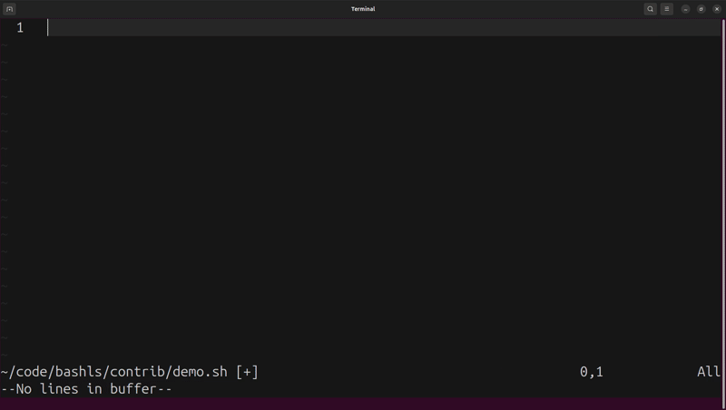

# bashls

[](https://github.com/k8s-1/bashls/actions/workflows/ci.yml)
[](https://crates.io/crates/bashls)

A Bash language server (LSP) written in Rust. Provides IDE features — completions, hover, diagnostics, formatting, rename, and go-to-definition — for shell scripts in any LSP-compatible editor (Neovim, Helix, Zed, Emacs).



## Motivation

[bash-language-server](https://github.com/bash-lsp/bash-language-server) errors had pushed my logs past 1 GB. My editor was slowing down. I wanted something self-contained.

## Features

- Hover documentation
- Completions (variables, functions, executables, builtins, snippets)
- Jump to definition
- Find references
- Rename
- Document and workspace symbols
- Diagnostics via [shellcheck](https://github.com/koalaman/shellcheck)
- Formatting via [shfmt](https://github.com/mvdan/sh)

## Installation

Diagnostics and formatting require additional tools:

- [shellcheck](https://github.com/koalaman/shellcheck)
- [shfmt](https://github.com/mvdan/sh)

#### Binary
Download from [releases page](https://github.com/k8s-1/bashls/releases), extract, and place `bashls` somewhere on your `$PATH`.

#### Cargo
```
cargo install bashls
```

#### From source
```
git clone https://github.com/k8s-1/bashls
cd bashls
cargo build --release
```

## Editor support

bashls works with any editor that supports LSP.

### Neovim

```lua
vim.lsp.config('bashls', {
  cmd = { 'bashls' },
  filetypes = { 'sh' },
  root_markers = { '.git' },
  -- init_options = {
  --   bashIde = { shellcheckPath = '/usr/bin/shellcheck' },
  -- },
})
vim.lsp.enable('bashls')
```

### Helix

```toml
[[language]]
name = "bash"
language-servers = ["bashls"]

[language-server.bashls]
command = "bashls"
```

### Zed

```json
{
  "lsp": {
    "bash-language-server": {
      "binary": {
        "path": "bashls",
      }
    }
  }
}
```

### Emacs

```elisp
(add-to-list 'eglot-server-programs
             '(sh-mode . ("bashls")))
```

## Configuration

Settings can be provided as LSP initialization options (under `bashIde`) or as environment variables (e.g. `bashIde.shellcheckPath` → `SHELLCHECK_PATH`).

| Setting (`bashIde.*`) | Default | Description |
|---|---|---|
| `shellcheckPath` | `shellcheck` | Path to shellcheck binary. |
| `shellcheckArguments` | `[]` | Additional arguments passed to [shellcheck](https://github.com/koalaman/shellcheck). |
| `shfmt.path` | `shfmt` | Path to shfmt binary. |
| `shfmt.*` | | See [shfmt](https://github.com/mvdan/sh) for remaining options. |
| `globPattern` | `**/*@(.sh\|.inc\|.bash\|.command)` | Files the server treats as bash. |
| `backgroundAnalysisMaxFiles` | `500` | Max files to analyse in background for workspace-wide features. |
| `includeAllWorkspaceSymbols` | `false` | Return functions and variables from all workspace files in symbol search, not just open files. |
| `enableSourceErrorDiagnostics` | `false` | Show diagnostics when a `source`/`.` command cannot be resolved. |

### CLI flags

| Flag | Default | Description |
|---|---|---|
| `--log-level` | `error` | Log verbosity: `error`, `warn`, `info`, `debug`, `trace`. Pass via the editor's server command, e.g. `cmd = { 'bashls', '--log-level', 'warn' }`. |

## Limitations

- **No [explainshell](https://explainshell.com) integration.** Supporting this would require pulling in an HTTP/TLS stack (~50 crates); skipped intentionally to keep the dependency footprint small.
- **Linux and macOS only.** This is a bash language server — if you're on Windows, use WSL.

## Benchmarks

Measured against [bash-language-server](https://github.com/bash-lsp/bash-language-server) 5.6.0 using 50 `.sh` files from [oh-my-bash](https://github.com/ohmybash/oh-my-bash) as a corpus. Startup is measured cold (no prior Node.js activity); 1500 ms is a typical cold-start. See [examples/lsp_bench.rs](examples/lsp_bench.rs) for the full methodology and instructions to reproduce.

<p align="center">
  <picture align="center">
    <source media="(prefers-color-scheme: dark)" srcset="https://raw.githubusercontent.com/k8s-1/bashls/main/assets/benchmark-dark.svg">
    <source media="(prefers-color-scheme: light)" srcset="https://raw.githubusercontent.com/k8s-1/bashls/main/assets/benchmark-light.svg">
    
  </picture>
</p>

## License

This project is released under the [MIT License](LICENSE).
