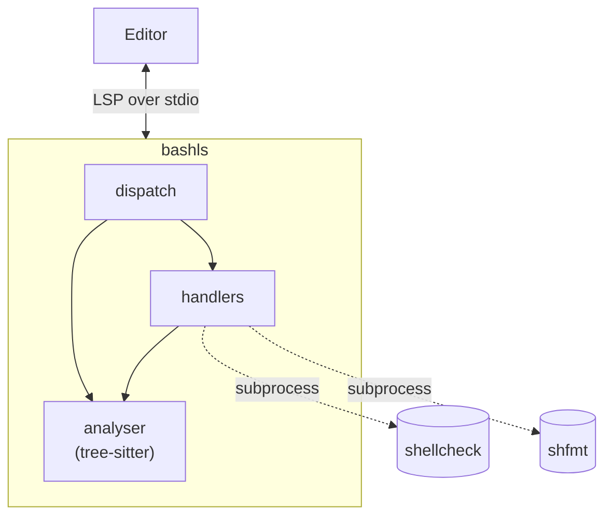

# Reference

## Architecture and Structure

```
src/
├── main.rs, lib.rs     entry point and crate root
├── analyser.rs         document store, tree-sitter parsing, symbol lookup
├── parser.rs           tree-sitter Parser init for bash
├── config.rs           config from env vars
├── server/             LSP message loop, dispatch, Server/DocumentState
├── handlers/           one handler per LSP feature (completion, hover, navigation, rename, code_action, formatting)
├── shellcheck/         diagnostics via shellcheck
├── shfmt/              formatting via shfmt
└── util/               shared helpers (declarations, sourcing, tree-sitter, LSP types, fs, shebang)
```


